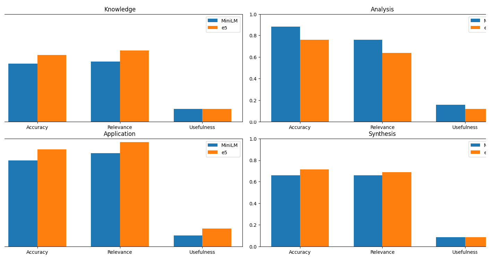

# NFL Draft Retrieval Augmented Generation (RAG) System
This RAG pipeline transforms defensive line scouting reports (PDF/PPTX) into an actionable database using ChromaDB. It compares two embedding models (MiniLM vs. E5) to retrieve context, using GPT-4 with a "Map-Reduce" strategy to synthesize coaching insights. Finally, it runs a data-driven evaluation to benchmark accuracy and relevance.

---

## Project Overview

This repository consists of three modular scripts that handle the lifecycle of a RAG system:

1. **`rag_embeddings_01.py` (The Librarian):** Extracts text from PDFs, PPTX, and TXT files. It handles deduplication and stores vector embeddings in **ChromaDB** using two different models for performance comparison.
2. **`rag_qa_02.py` (The Coach):** A command-line interface that adopts the persona of a Super Bowl-winning GM. It uses a **Map-Reduce** approach to summarize large chunks of scouting data via **GPT-4** without exceeding token limits.
3. **`rag_summary_stats_03.py` (The Analyst):** Processes a performance summary CSV to generate statistical correlations and performance visualizations.

---

## Performance Benchmarking

A key feature of this project is the comparative analysis between `all-MiniLM-L6-v2` and `e5-small-v2`. We evaluate performance based on:
* **Semantic Similarity:** Retrieval confidence scores.
* **Accuracy:** Factual correctness of the scouting summary.
* **Relevance:** How well the AI addressed specific coaching needs.
* **Usefulness:** Practical value for a front-office decision-maker.

### Evaluation Results
The chart below breaks down the model performance across different cognitive levels (Knowledge, Analysis, Application, and Synthesis):



---

##  Tech Stack

* **LLM:** OpenAI GPT-4
* **Vector Database:** ChromaDB
* **Embedding Models:** * `sentence-transformers/all-MiniLM-L6-v2`
  * `intfloat/e5-small-v2`
* **Data Processing:** Pandas, NumPy, PyMuPDF (fitz), python-pptx
* **Visualization:** Matplotlib, Seaborn

## Data Privacy & Proprietary Information

**Note on Data Availability:** The raw scouting reports, PFF data, and specific prospect CSVs used to develop this project have been **omitted from this repository** due to privacy and proprietary data restrictions. 

To use this tool, you must provide your own directory of documents and update the paths in the scripts accordingly. The architecture is designed to be data-agnostic, allowing users to plug in their own proprietary scouting datasets.

---

## Installation & Usage

### 1. Setup Environment
```bash
# Create and activate a virtual environment (optional but recommended)
python -m venv venv
source venv/bin/activate  # On Windows use `venv\Scripts\activate`

# Install all dependencies at once
pip install -r requirements.txt
